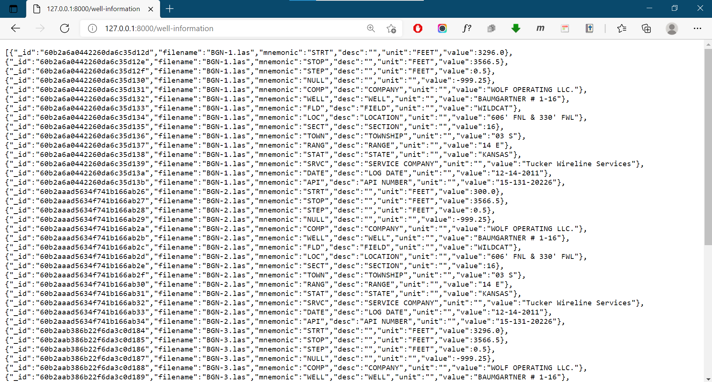
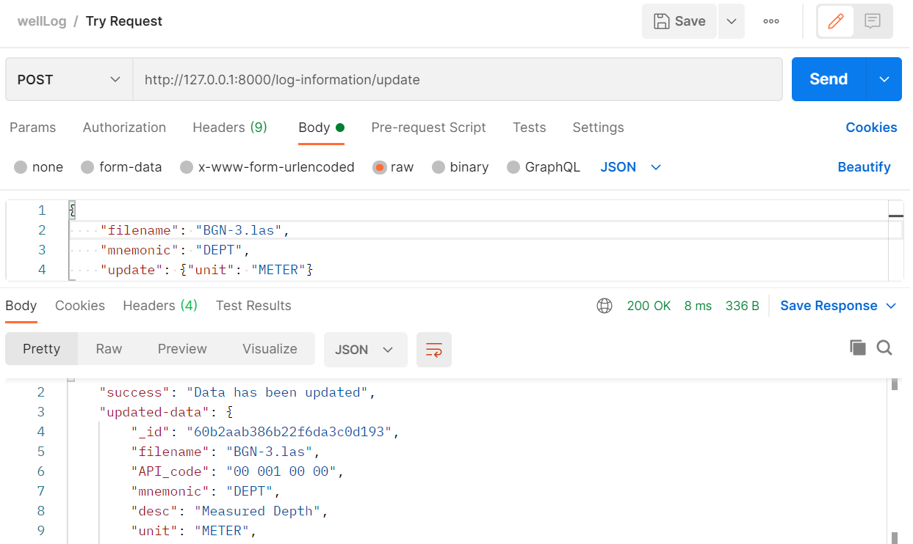

# Microservices - Well Log Data
Back-End software using framework `FASTAPI` and `mongoDB` for  integrate well log data with file format `.las`.

This software has several main features, as follows:
- Upload file `.las` and auto-save at `NoSQL` Database
- Get Collection Data
- Search Data*
- Delete Data**
- Update Data**

<small>* based on `filename`</small> 
<small>** based on `filename` with `mnemonic`</small>

## Entity Relationship Diagram (ERD)
This software using noSQL database to store and access well log data, there are 3 collections in database consisting of __well information__, __log information__ and __log data__. 

Relationship between colletions are represented in the ERD below.

## Upload File
.............................................

## Get Collection Data
To get data from collection can access request URL: 
- `{url}/log-data`,
- `{url}/well-information`, or
- `{url}/log-information`

<small>* using localhost `127.0.0.1.8000`</small>

## Search Data
__search data__ using `POST` route in Postman with request URL: 
- `{url}/{collection}/search`

## Update Data
__update data__ using `POST` route in Postman with request URL: 
- `{url}/{collection}/update`, and add new `dict` to modify data

## Delete Data
__delete data__ using `POST` route in Postman with request URL: 
- `{url}/{collection}/delete`

